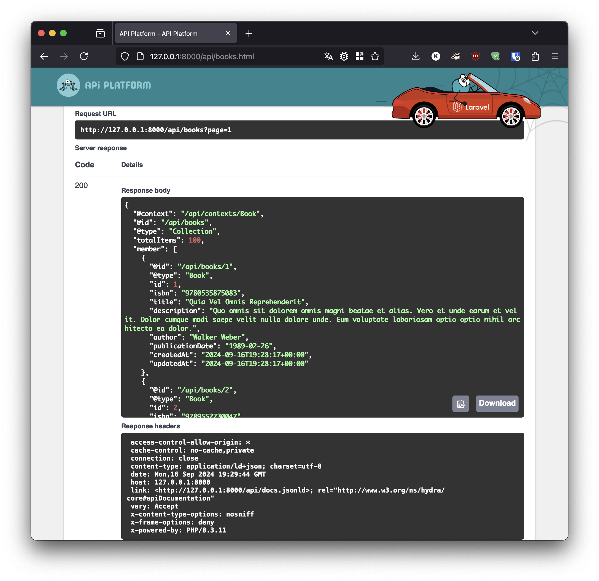
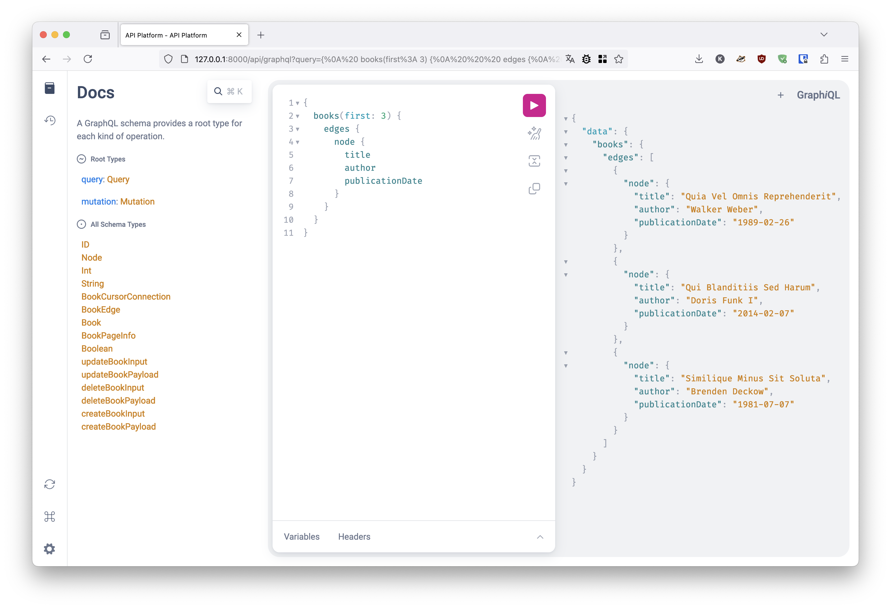
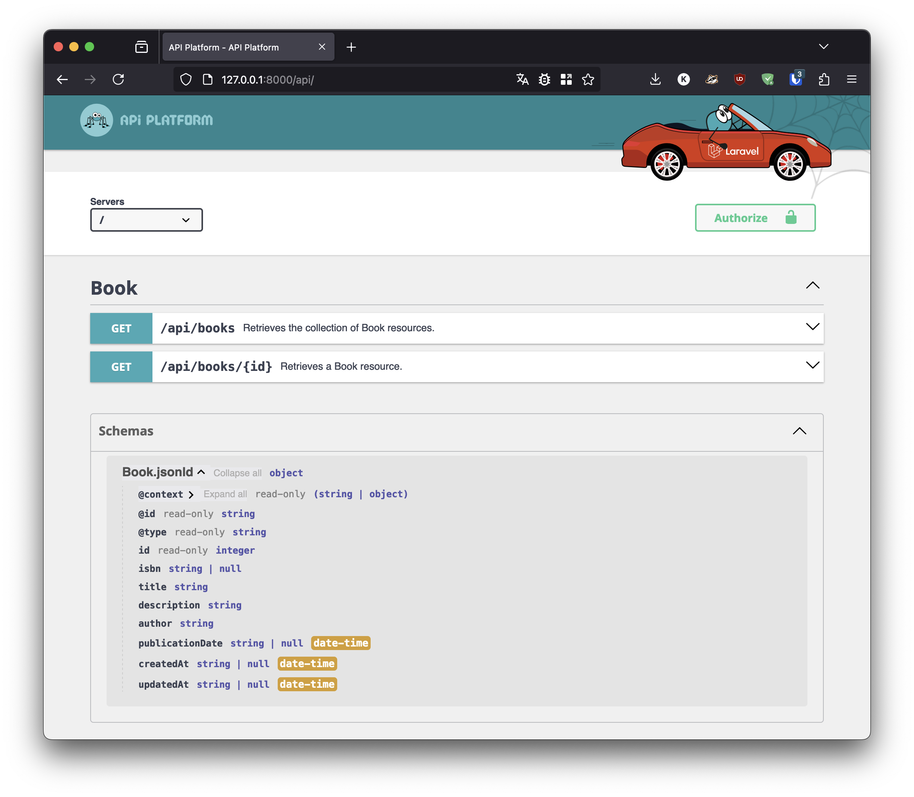
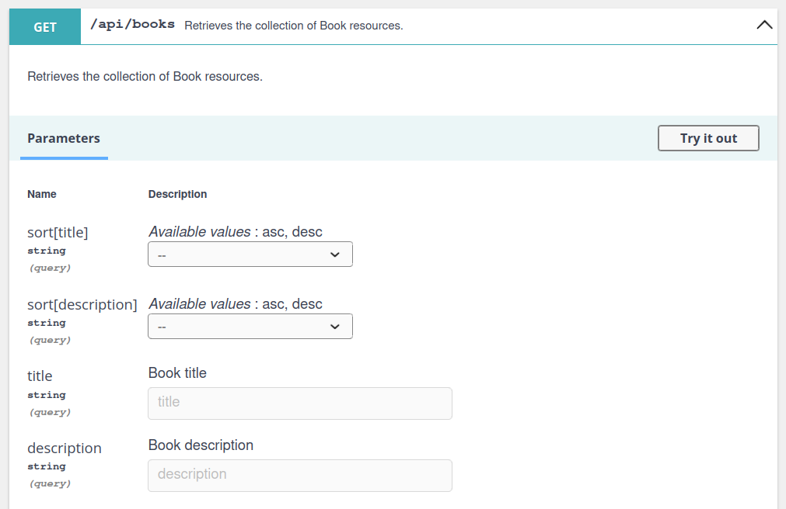
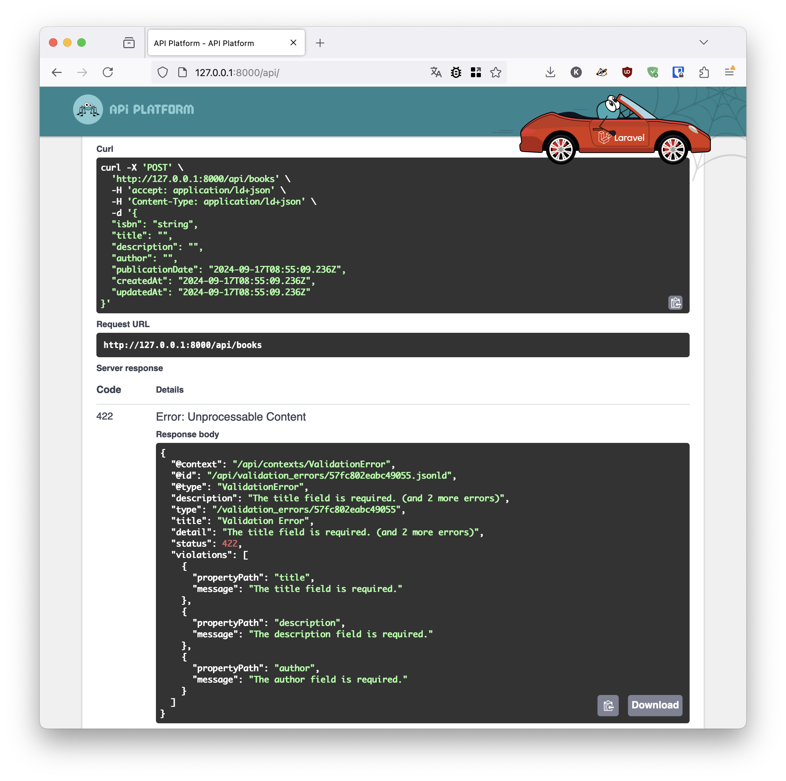

# API Platform for Laravel Projects

API Platform is **the easiest way** to create **state of the art** web APIs
using Laravel!


With API Platform, you can:

* expose your Eloquent models in minutes as:
  * a REST API implementing the industry-leading standards and best practices: JSON-LD, JSON:API and HAL
  * a GraphQL API
  * or both at the same time, with the same code!
* automatically expose an OpenAPI specification (formerly Swagger), dynamically generated from your Eloquent models and always up to date
* automatically expose nice UIs and playgrounds to develop using your API (Swagger UI, Redoc, GraphiQL and/or GraphQL Playground)
* automatically paginate your collections
* add validation logic using Laravel logic
* add authorization logic using gates and policies (compatible with Passport and Sanctum)
* add filtering logic
* push changed data to the clients in real-time using Laravel Broadcast and [Mercure](https://mercure.rocks) (a popular WebSockets alternative, created by Kévin Dunglas, the original author of API Platform) and receive them using Laravel Echo
* benefits from the API Platform JavaScript tools: [admin](../admin/index.md) and [create client](../create-client/index.md) (supports Next/React, Nuxt/Vue.js, Quasar, Vuetify and more!)
* benefits from native HTTP cache (with automatic invalidation)
* boost your app with [Octane](https://laravel.com/docs/octane) and [FrankenPHP](https://frankenphp.dev) (the default Octane engine, also created by Kévin)
* [decouple your API from your models](../core/state-providers.md) and implement patterns such as CQRS
* test your API using convenient ad-hoc assertions that works with Pest and PHPUnit

Let's discover how to use API Platform with Laravel!

## Installing Laravel

API Platform can be installed easily on new and existing Laravel projects.
If you already have an existing project, skip directly to the next section.

If you don't have an existing Laravel project, [create one](https://laravel.com/docs/installation).
All Laravel installation methods are supported. For instance, you can use Composer:

```console
composer create-project laravel/laravel my-api-platform-laravel-app
cd my-api-platform-laravel-app
```

## Installing API Platform

In your Laravel project, install the API Platform integration for Laravel:

```console
composer config minimum-stability beta
composer require api-platform/laravel:^4@beta
```

If it's not already done, run `php artisan serve` to start the built-in web server.

Open http://127.0.0.1:8000/api/, your API is already active and documented... but empty!


## Creating an Eloquent Model

To discover how API Platform framework works, we will create an API to manage a bookshop.

Let's start by creating a `Book` model:

```console
php artisan make:model Book
```

By default, Laravel uses SQLite. You can open the `database/database.sqlite` file with your prefered SQLite client (PHPStorm works like charm), create a table named `books` and add some columns, Eloquent and API Platform will detect these columns automatically.

But there is a better alternative: using a migration class.

### Creating a Migration

First, create a migration class for the `books` table:

```console
 php artisan make:migration create_books_table
```

Open the generated migration class (`database/migrations/<timestamp>_create_books_table.php`) and add some columns:

```patch
    public function up(): void
    {
        Schema::create('books', function (Blueprint $table) {
            $table->id();

+            $table->string('isbn')->nullable();
+            $table->string('title');
+            $table->text('description');
+            $table->string('author');
+            $table->date('publication_date')->nullable();

            $table->timestamps();
        });
    }
```

Finally execute the migration:

```console
php artisan migrate
```

The table and columns have been created for you!

## Exposing A Model

Open `app/Models/Book.php` that we generated in the previous step and mark the class it contains with the `#[ApiResource]` attribute:

```patch
namespace App\Models;

+use ApiPlatform\Metadata\ApiResource;
 use Illuminate\Database\Eloquent\Model;

+#[ApiResource]
 class Book extends Model
 {
 }
```

Open http://127.0.0.1:8000/api/, tadam, your API is ready and **entirely functionnal** 🎉:


You can play with your API with the sandbox provided by SwaggerUI.

Under the hood, API Platform:

1. Registered the standard REST routes in Laravel's router and a controller that implements a state-of-the-art, fully-featured and secure API endpoint using the services provided by the [API Platform Core library](../core/index.md)
2. Used its built-in Eloquent [state provider](../core/state-providers.md) to introspect the database and gather metadata about all columns to expose through the API
3. Generated machine-readable documentations of the API in the [OpenAPI (formerly known as Swagger)](../core/openapi.md) (available at http://127.0.0.1:8000/api/docs.json) and [JSON-LD](https://json-ld.org)/[Hydra](https://www.hydra-cg.com) formats using these metadata TODO: .openapi is broken
4. Generated a nice human-readable documentation and a sandbox for the API with [SwaggerUI](https://swagger.io/tools/swagger-ui/) (Redoc is also available out-of-the-box)

Imagine doing it all again, properly, by hand? How much time have you saved? Weeks, months? And you've seen nothing yet!

## Playing With The API



If you access any API URL with the `.html` extension appended, API Platform displays
the corresponding API request in the UI. Try it yourself by browsing to `http://127.0.0.1:8000/api/books.html`. If no extension is present, API Platform will use the `Accept` header to select the format to use.

So, if you want to access the raw data, you have two alternatives:

* Add the correct `Accept` header (or don't set any `Accept` header at all if you don't care about security) - preferred when writing API clients
* Add the format you want as the extension of the resource - for debug purpose only

For instance, go to `http://127.0.0.1:8000/api/books.jsonld` to retrieve the list of `Greeting` resources in JSON-LD.

Of course, you can also use your favorite HTTP client to query the API.
We are fond of [Hoppscotch](https://hoppscotch.com), a free and open source API client with good support of API Platform.

## Content Negotiation

By default, a JSON-LD response is sent [but many other formats, including CSV and JSON:API are supported](../core/content-negotiation.md).
You can enable or disable formats in `config/api-platform.php`:

```php
// config/api-platform.php

// ...
return [
    'formats' => [
        'jsonld' => ['application/ld+json'],
        'jsonapi' => ['application/vnd.api+json'],
        'csv' => ['text/csv'],
    ],

    'patch_formats' => [
        'json' => ['application/merge-patch+json'],
    ],

    'docs_formats' => [
        'jsonld' => ['application/ld+json'],
        'jsonapi' => ['application/vnd.api+json'],
        'jsonopenapi' => ['application/vnd.openapi+json'],
        'html' => ['text/html'],
    ],

    // ...
];
```

## Enabling GraphQL



By default, only the REST endpoints are enabled, but API Platform also [supports GraphQL](../core/graphql.md)!

Install the GraphQL support package:

```console
composer require api-platform/graphql:^4@beta
```

Then, enable GraphQL in `config/api-platform.php`:

```patch
     'graphql' => [
-        'enabled' => false,
+        'enabled' => true,
```

Then open `http://127.0.0.1:8000/api/graphql` and replace the default GraphQL query example with:
```
{
  books(first: 3) {
    edges {
      node {
        title
        author
        publicationDate
      }
    }
  }
}
```

You now have a REST and a GraphQL API with the same code!

As you can see, a nice UI ([GraphiQL](https://github.com/graphql/graphiql)) is also available. The documentation is automatically generated using the GraphQL introspection endpoint.

## Hiding Fields

API Platform allows to control which fields will be publicly exposed by the API using [the same syntax as Eloquent serialization](https://laravel.com/docs/eloquent-serialization#hiding-attributes-from-json):

```php
namespace App\Models;

use ApiPlatform\Metadata\ApiResource;
use Illuminate\Database\Eloquent\Model;

#[ApiResource]
class Book extends Model
{
    /**
     * The attributes that should be hidden (deny list).
     *
     * @var array
     */
    protected $hidden = ['isbn'];
}
```

```php
namespace App\Models;

use ApiPlatform\Metadata\ApiResource;
use Illuminate\Database\Eloquent\Model;

#[ApiResource]
class Book extends Model
{
    /**
     * The attributes that should be visible (allow list).
     *
     * @var array
     */
    protected $visible = ['title', 'description'];
}
```

## Relations and Nested Ressources

docs todo

## Paginating Data

A must-have feature for APIs is pagination. Without pagination, collections responses quickly become huge and slow,
and can even lead to crashes (Out of Memory, timeouts...).

Fortunately, the Eloquent state provider provided by API Platform automatically paginates data!

To test this feature, let's inject some fake data in the database.

### Seeding the Database

Instead of manually creating the data you need to test your API,
it can be convenient to automatically insert fake data in the database.

Laravel provides a convenient way to do that: [Eloquent Factories](https://laravel.com/docs/eloquent-factories).

First, create a factory class for our `Book` model:

```console
php artisan make:factory BookFactory
```

Then, edit `database/factories/BookFactory.php` to specify which generator to use for each property of the model:

```patch
 namespace Database\Factories;
 
 use Illuminate\Database\Eloquent\Factories\Factory;
 
 /**
  * @extends \Illuminate\Database\Eloquent\Factories\Factory<\App\Models\Book>
  */
 class BookFactory extends Factory
 {
     /**
      * Define the model's default state.
      *
      * @return array<string, mixed>
      */
     public function definition(): array
     {
         return [
-            //
+            'title' => mb_convert_case(fake()->words(4, true), MB_CASE_TITLE),
+            'isbn' => fake()->isbn13(),
+            'description' => fake()->text(),
+            'author' => fake()->name(),
+            'publication_date' => fake()->date(),
         ];
     }
 }
```

Then, update the `app/Models/Book.php` to hint Eloquent that it has an associated factory:

```patch
 namespace App\Models;
 
 use ApiPlatform\Metadata\ApiResource;
+use Illuminate\Database\Eloquent\Factories\HasFactory;
 use Illuminate\Database\Eloquent\Model;
 
 #[ApiResource]
 class Book extends Model
 {
+    use HasFactory;
 }
```

Reference this factory in the seeder (`database/seeder/DatabaseSeeder.php`):

```patch
 namespace Database\Seeders;
 
 use App\Models\Book;
 use App\Models\User;
 // use Illuminate\Database\Console\Seeds\WithoutModelEvents;
 use Illuminate\Database\Seeder;
 
 class DatabaseSeeder extends Seeder
 {
     /**
      * Seed the application's database.
      */
     public function run(): void
     {
         // User::factory(10)->create();
 
         User::factory()->create([
             'name' => 'Test User',
             'email' => 'test@example.com',
         ]);
 
+        Book::factory(100)->create();
     }
 }
```

Finally, seed the database:

```console
php artisan db:seed
```

> [!NOTE]
>
> The `fake()` helper provided by Laravel lets you generate different types of random data for testing and seeding purposes. It uses [the Faker library](https://fakerphp.org), which has been created by François Zaninotto.
> François is also a member of the API Platform Core Team.
> He maintains [API Platform Admin](../admin/index.md), a tool built on top of his popular [React-Admin](https://marmelab.com/react-admin/) library that makes creating admin interfaces consuming your API data super easy.
> What a small world!

### Configuring The Pagination

Send a `GET` request on http://127.0.0.1:8000/api/books.

By default, API Platform paginates collections by slices of 30 items.

This is configurable, to change to 10 items per page, change `app/Models/Book.php` like this:

```patch
 namespace App\Models;
 
 use ApiPlatform\Metadata\ApiResource;
 use Illuminate\Database\Eloquent\Factories\HasFactory;
 use Illuminate\Database\Eloquent\Model;
 
-#[ApiResource]
+#[ApiResource(
+    paginationItemsPerPage: 10,
+)]
 class Book extends Model
 {
     use HasFactory;
 }
```

Read the [pagination documentation](../core/pagination.md) to learn all you can do!

## Customizing the API

API Platform has a ton of knobs and gives you full control over what is exposed.

For instance, here how to make your API read-only by enabling only the `GET` [operations](../core/operations.md):

```patch
// app/Models/Book.php

-#[ApiResource]
 #[ApiResource(
     paginationItemsPerPage: 10,
+    operations: [
+        new GetCollection(),
+        new Get(),
+    ],
 )]
 class Book extends Model
 {
 }
```



We'll use configuration options provided by API Platform all along this getting started guide, but there are tons of feature!

A good way to discover them is to inspect the properties of the `ApiResource` and `ApiProperty` attributes, and, of course, to [read the documentation of the core library](../core/index.md).

You can change the default configuration (for instance, which operations are enabled by default) in the config (`config/api-platform.php`).

For the rest of this tutorial, we'll assume that at least all default operations are enabled (you can also enable `PUT` if you want to support upsert operations).


## Adding Filters

API Platform provides an easy shortcut to some [useful filters](./filters.md), for starters you can enable a `PartialSearchFilter` the title property:

```patch
// app/Models/Book.php

  use ApiPlatform\Metadata\ApiResource;
+ use ApiPlatform\Laravel\Eloquent\Filter\PartialSearchFilter;

 #[ApiResource]
+ #[QueryParameter(key: 'title', filter: PartialSearchFilter::class)]
class Book extends Model
{
}
```


It's also possible to enable filters on every exposed properties:

```patch
// app/Models/Book.php

  use ApiPlatform\Metadata\ApiResource;
+ use ApiPlatform\Laravel\Eloquent\Filter\PartialSearchFilter;
+ use ApiPlatform\Laravel\Eloquent\Filter\OrderFilter;

 #[ApiResource]
+ #[QueryParameter(key: ':property', filter: PartialSearchFilter::class)]
+ #[QueryParameter(key: 'sort[:property]', filter: OrderFilter::class)]
class Book extends Model
{
}
```

The `OrderFilter` allows us to sort the collection.

The `:property` placeholder gives the ability to create a parameter for each exposed property. These filters will be automatically documented:



On top of that, some validation rules are automatically added based on the given JSON Schema. You can customize the set of rules inside the `constraints` option of a `QueryParameter`.

API Platform comes with many several filters dedicated to Laravel, [check them out](filters.md)!

## Write Operations Authorization and Validation



To authorize write operations (`POST`, `PATCH`, `PUT`) and validate user input, you may generate a [Form Request class](https://laravel.com/docs/validation#creating-form-requests):

```console
php artisan make:request BookFormRequest
```

Then, add validation rules to the generated class (`app/Http/Requests/BookFormRequest.php` in our example):

```
 namespace App\Http\Requests;

 use Illuminate\Foundation\Http\FormRequest;

 class BookFormRequest extends FormRequest
 {
     /**
      * Determine if the user is authorized to make this request.
      */
     public function authorize(): bool
     {
-        return false;
+        return user()->isAdmin();
     }
 
     /**
      * Get the validation rules that apply to the request.
      *
      * @return array<string, \Illuminate\Contracts\Validation\ValidationRule|array<mixed>|string>
      */
     public function rules(): array
     {
         return [
-             //
+            'title' => 'required|unique:books|max:255',
+            'description' => 'required',
+            'author' => 'required|max:100',
         ];
     }
 }
```

In this example, we only authorize admin users to do write operations, and we add some validation rules.

Use this set of rules in your resource to authorize and validate user input:

```patch
// app/Models/Book.php
+use App\Http\Requests\BookFormRequest;

-#[ApiResource]
 #[ApiResource(
     paginationItemsPerPage: 10,
+    rules: BookFormRequest::class
)]
 class Book extends Model
 {
 }
```

API Platform will transform any exception in the [RFC 7807](https://www.rfc-editor.org/rfc/rfc7807) (Problem Details for HTTP APIs) format.
You can create your own `Error` resource following [this guide](https://api-platform.com/docs/guides/error-resource/).

Read the detailed documentation about [Laravel data validation in API Platform](validation.md).

## Securing the API With Gates and Policies

To protect an operation, we create a Laravel [policy](https://laravel.com/docs/authorization#creating-policies): 

```console
php artisan make:policy BookPolicy --model=Book
```

If you want you can also add Sanctum:

```console
php artisan install:api
```

Then we can plug the `auth:sanctum` middleware and specify what policy to use: 

```patch
// app/Models/Book.php

-#[ApiResource]
 #[ApiResource(
     paginationItemsPerPage: 10,
+    operations: [
+       new Patch(
+            middleware: 'auth:sanctum',
+            policy: 'update'
+       ),
+    ],
)]
 class Book extends Model
 {
 }
```

Read the detailed documentation about using [Laravel gates and policies with API Platform](security.md).

<!-- ## Testing the API

TODO-->

## Using The `IsApiResourceTrait` Instead of Attributes

While attributes (introduced in PHP 8) are the preferred way to configure your API Platform resources,
it's also possible to use a trait instead.

These two classes are strictly equivalent:

```php
// Attributes
namespace App\Models;

use ApiPlatform\Metadata\ApiResource;
use Illuminate\Database\Eloquent\Model;

#[ApiResource]
class Book extends Model
{
}
```

```php
// Trait
namespace App\Models;

use ApiPlatform\Metadata\IsApiResource;
use Illuminate\Database\Eloquent\Model;

class Book extends Model
{
    use IsApiResource;
}
```

When using the `IsApiResourceTrait`, it's also possible to return advanced configuration by definining an `apiResource()` static method.

These two classes are strictly equivalent:

```php
// Attributes
namespace App\Models;

use ApiPlatform\Metadata\ApiResource;
use Illuminate\Database\Eloquent\Model;

#[ApiResource(
    paginationItemsPerPage: 10,
    operations: [
       new GetCollection(),
       new Get(),
    ],
)]
class Book extends Model
{
}
```

```php
// Trait
namespace App\Models;

use ApiPlatform\Metadata\IsApiResource;
use Illuminate\Database\Eloquent\Model;

class Book extends Model
{
    use IsApiResource;

    public static function apiResource(): ApiResource
    {
        return new ApiResource(
            paginationItemsPerPage: 10,
            operations: [
                new GetCollection(),
                new Get(),
            ],
        );
    }
}
```

It's quite common to define multiple `ApiResource`, `ApiProperty` and `Filter` attributes on a same class.
To mimick this behavior, the `apiResource()` function can return an array instead of a single instance of medata class.

These two classes are strictly equivalent:

```php
// Attributes
namespace App\Models;

use ApiPlatform\Metadata\ApiResource;
use ApiPlatform\Metadata\QueryParameter;
use ApiPlatform\Laravel\Eloquent\Filter\PartialSearchFilter;
use App\Http\Requests\BookFormRequest;
use Illuminate\Database\Eloquent\Model;

#[ApiResource(
    paginationEnabled: true,
    paginationItemsPerPage: 5,
    rules: BookFormRequest::class,
    operations: [
        new Put(),
        new Patch(),
        new Get(),
        new Post(),
        new Delete(),
        new GetCollection(),
    ]
)]
#[QueryParameter(key: ':property', filter: PartialSearchFilter::class)]
class Book extends Model
{
}
```

```php
// Trait
namespace App\Models;

use ApiPlatform\Metadata\IsApiResource;
use ApiPlatform\Metadata\QueryParameter;
use ApiPlatform\Laravel\Eloquent\Filter\PartialSearchFilter;
use App\Http\Requests\BookFormRequest;
use Illuminate\Database\Eloquent\Model;

class Book extends Model
{
    use IsApiResource;

    public static function apiResource(): array
    {
        return [
            new ApiResource(
                paginationEnabled: true,
                paginationItemsPerPage: 5,
                rules: BookFormRequest::class,
                operations: [
                    new Put(),
                    new Patch(),
                    new Get(),
                    new Post(),
                    new Delete(),
                    new GetCollection(),
                ]
            ),
            new QueryParameter(key: ':property', filter: PartialSearchFilter::class),
        ];
    }
}
```


